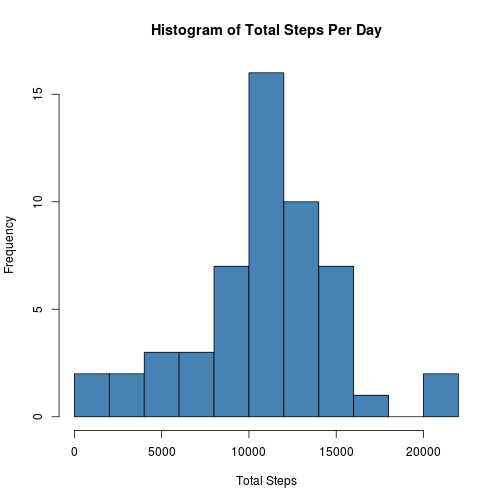
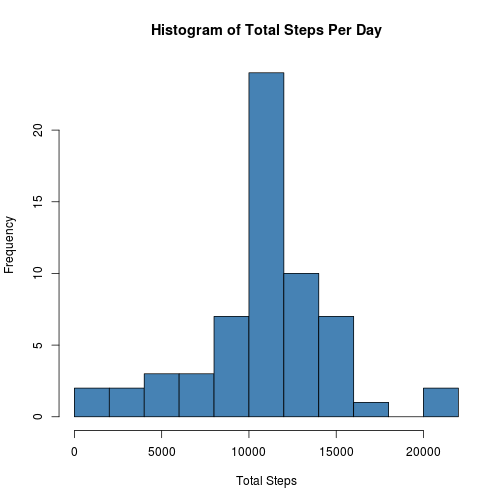
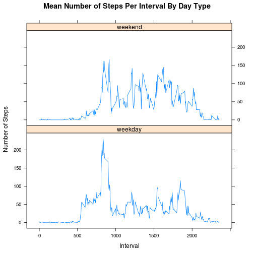

# Reproducible Research: Peer Assessment 1
---
   
## Install necessary packages

```r
library(RCurl); library(dplyr); library(lattice)
```
---

## Loading and preprocessing the data

```r
## Check to see if raw data file exists
if(!file.exists("./activity.csv")){
        
## Download data if not already present
fileUrl <- "https://d396qusza40orc.cloudfront.net/repdata%2Fdata%2Factivity.zip"
        download.file(fileUrl, destfile="./activity.zip", method="curl")
        
## Unzip downloaded zip file
unzip("./activity.zip")
}

## Load activity data and convert to table
activity <- read.csv("./activity.csv", stringsAsFactors=F)
activity_data <- tbl_df(activity)
```
---

## What is mean total number of steps taken per day?

```r
options(scipen=999) ## to prevent mean from printing in scientific notation

## create summary data including daily totals
total_steps <- summarise(group_by(activity_data, date), total = sum(steps))

## produce mean and median calculations for summary data
meanSteps <- round(mean(total_steps$total, na.rm=T), 2)
medianSteps <- median(total_steps$total, na.rm=T)

## create histogram 
hist(total_steps$total, breaks=10, xlab="Total Steps", col="steelblue",
     main="Histogram of Total Steps Per Day")
```

 

The **mean** total steps taken per day is **10766.19**.  
The **median** total steps taken per day is **10765**.  

---  

## What is the average daily activity pattern?

```r
## create summary data including means for each interval
int_mean <- summarise(group_by(activity, interval), MeanSteps = mean(steps, na.rm=T))

## create time series plot of 5-minute intervals averaged across all days
plot(int_mean$interval, int_mean$MeanSteps, type="l", xlab="Interval (5-min)",
     ylab="Steps Taken (Mean)", main="Average Steps Taken During 5-min Intervals")
```

 

```r
## find interval with highest mean and find the value of that mean
maxInt <- round(int_mean[which.max(int_mean$MeanSteps),], 2)
```
  
The 5-minute interval with the greatest average number of steps taken is **835**.
The average number of steps taken during this interval is **206.17**.  

---

## Imputing missing values

```r
## calculate the total number of missing values
numMissing <- sum(is.na(activity_data$steps))
```
  
The number of missing values in the dataset is **2304**.  

To fill in the missing values, I performed the following steps:  

1. Added a column of the interval means (from 'int_mean') to the 'activity_data' dataset.
2. Created an index of empty values from the "steps" column.
3. Used that index to replace each empty value with the value for the mean of that interval.  
   
   

```r
## join interval means to main dataset
impData <- left_join(activity_data, int_mean)

## create list of indices for which values are NA
stepsNA <- which(is.na(impData$steps))

## replace missing interval data with mean for that interval
impData$steps <- replace(impData$steps, stepsNA, impData$MeanSteps[stepsNA])

## calculate total number of missing values after imputation
numMissing2 <- sum(is.na(impData$steps))
```
   
After imputing the missing values, the total number of missing values is **0**.  
   

```r
## create summary data including daily totals after imputation
total_steps2 <- summarise(group_by(impData, date), total = sum(steps))

## create historgram
hist(total_steps2$total, breaks=10, xlab="Total Steps", col="steelblue",
     main="Histogram of Total Steps Per Day")
```

 

```r
## produce new mean and median calculations for summary data
meanSteps2 <- round(mean(total_steps2$total), 2)
medianSteps2 <- round(median(total_steps2$total), 2)

## create list of dates that previously contained NA values
datesNA <- total_steps2$date[which(is.na(total_steps$total))]
```
   
   
After imputing the data, the **mean** total steps taken per day is **10766.19** and the **median** total steps taken per day is **10766.19**.

The difference in means after imputing is **0**.  
The difference in median after imputing is **1.19**. 

Imputing missing data only affected those dates where there were missing values.  These dates are as follows:  
**2012-10-01, 2012-10-08, 2012-11-01, 2012-11-04, 2012-11-09, 2012-11-10, 2012-11-14, 2012-11-30**  

---
## Are there differences in activity patterns between weekdays and weekends?


```r
## convert dates to days of the week, create factor variable of weekdays and weekends
impData$day <- weekdays(as.Date(impData$date))
impData$day <- ifelse(impData$day %in% c("Saturday", "Sunday"), "weekend", "weekday")
impData$day <- factor(impData$day, levels=c("weekday", "weekend"))
```


```r
## create summary data grouped by day type (weekend, weekday)
mean_steps2 <- summarise(group_by(impData, interval, day), mean = mean(steps, na.rm=T))

## create panel plot with time series plots comparing weekend and weekdays
xyplot(mean ~ interval | day, data=mean_steps2, layout=c(1,2), 
       ylab="Number of Steps", xlab="Interval", type="l", 
       main="Mean Number of Steps Per Interval By Day Type")
```

 
   
There is a difference in activity patterns between weekdays and weekends.  The patterns are more evenly spread out throughout the day than on weekdays.  The interval in and around 8:00-9:00AM is the most active time, on both weekdays and weekends. 
